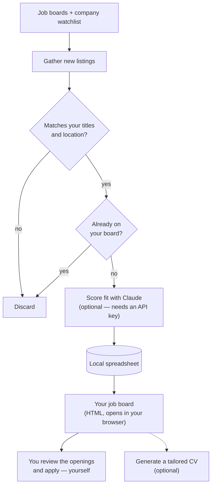

# My Job Board

A small, run-it-yourself job board for **product designers** (but customizable for other roles too). It gathers new
product/design roles from a dozen job boards and a watchlist of companies, filters
them down to what you want, optionally uses Claude to score how well each one
fits *you*, and collects them into a single personal board — all on your machine. No
account, no SaaS, no data leaving your computer.

It ships with a ready-made watchlist and a product-designer filter, so it's useful on
first run — then you make it yours (see **[Making it your own](#making-it-your-own)**).

## Why I built this

Job hunting meant checking a dozen different boards by hand, over and over. LinkedIn's
search is broken enough that I couldn't rely on it, and a lot of the other boards want
to **charge you** to see or apply to listings — which, for someone who's out of work and
looking, I find despicable. You shouldn't have to pay to find a job.

So I built my own system: one script that sweeps all those boards for me and gathers the
relevant postings into a single page, instead of clicking through every site
manually. It saves the time-consuming part — the *finding* — while deliberately leaving
the *deciding* to me. It does **not** auto-apply: I still want to read each opening and
judge for myself whether it's worth pursuing.

## How it works

You run it whenever you want to check for new roles; each run gathers, filters, scores,
and refreshes the board. It never applies to anything for you.

## What this does, in plain English

Each time you run it, this project:
1. Checks a handful of job boards, plus a specific list of companies, for new design/product listings
2. Filters out anything that doesn't match your target job titles or isn't your-location-friendly
3. Skips anything already sitting in your spreadsheet, so nothing gets logged twice
4. If you've set up an Anthropic API key, sends whatever's genuinely new to Claude, which reads each listing and fills in the details — salary, a plain-language summary, pros, cons, and a 1-10 fit score against your background and what you're looking for. Without a key, it logs the raw listing details instead, with no AI summary or fit score.
5. Adds one new row per listing to a local spreadsheet file, right in this project folder

There's no automatic scheduling here — you run it yourself, whenever you want to check for new listings (once a day, a few times a week, whatever suits you). Because it always checks the spreadsheet for what's already there before adding anything, running it more or less often never causes duplicates — it just changes how far back each run reaches.

---

## One-time setup

The Anthropic API key is optional. Without one, the script still gathers, filters, and dedupes listings and logs them to the spreadsheet — you just get the raw title/company/location/link/salary as posted, with no AI-written summary, company description, pros/cons, or fit score, and "Other Notes" says the key wasn't set. With a key it's pay-as-you-go and cheap — see [Costs](#costs) for a worked estimate (roughly $1–2/month running it daily, using Haiku).

The fit score is scored against the candidate background in `CANDIDATE_PROFILE` in `config.js` — update that whenever your experience or what you're looking for changes, since it's the only thing the scoring depends on.

### 1. An Anthropic API key (optional)
- Go to `console.anthropic.com` and create an account if you don't already have one
- Under **Billing**, add a payment method — the API is billed separately from any Claude.ai subscription, per token used
- Go to **API Keys**, create a new key, and copy it somewhere safe — you won't be able to view it again after this

The spreadsheet itself needs no setup at all — `job-listings.xlsx` gets created automatically, right in this project folder, the first time the script runs. Open it directly in Excel or Numbers whenever you want to check on it, or drag it into Google Sheets if you'd rather work with it there — it's a completely standard file, nothing about it is locked to any one app.

### 2. The watchlist (optional — it already works)
The `WATCHLIST` in `config.js` ships pre-filled with ~150 companies, each with a confirmed ATS token, so it works out of the box — there's nothing to set up here. Skip straight to running it unless you want to tune the list.

To **add your own** company, find it on its ATS and copy the token from the careers URL:
- `boards.greenhouse.io/something` → `ats: "greenhouse"`, `token: "something"`
- `jobs.lever.co/something` → `ats: "lever"`, `token: "something"`
- `jobs.ashbyhq.com/something` → `ats: "ashby"`, `token: "something"`

If a company runs on something else (a fully custom careers page, Workable, etc.), skip it — you'll still catch their postings through the broad-search boards. And if a run ever reports a watchlist company as failed, its token has probably drifted (companies occasionally change or rename their board) — fix or delete that line.

### 3. Running it

1. Install Node.js if you don't already have it (`nodejs.org`) — you'll want version 20.6 or newer. Check with `node -v` in Terminal.
2. If you got an Anthropic key in step 1, copy `.env.example` to a new file named `.env` in this folder and paste it in. Skip this if you're running without AI summaries.
3. In Terminal, `cd` into this folder and run `npm install` — a one-time step that downloads the few packages this project depends on
4. Whenever you want to check for new listings from here on: run `npm start`
5. Watch the output — it'll tell you how many listings it found, how many matched your filters, and how many were actually new. Then open `job-listings.xlsx` in this folder to see them.

That's it — no scheduling, no background setup. Steps 1–3 are one-time; from then on, step 4 is the whole routine whenever you want to check.

---

## What's still a best-effort heuristic, not a guarantee

- **Location filtering** is plain text matching — does the listing mention Europe, Ireland, or a specific European country. Job boards phrase location wildly inconsistently, so expect the occasional wrong result, and adjust the keyword list in `config.js` as you notice patterns.
- **If a watchlist company switches their careers system**, their `ats`/`token` in `config.js` will need updating — this happens occasionally as companies grow.
- **The spreadsheet only exists on this Mac** — unlike Google Sheets, there's no automatic cloud copy. If you want that safety net without changing anything else about the setup, put this whole project folder inside an iCloud Drive, Dropbox, or similar synced folder — the script won't care, and your data gets backed up as a side effect.

## Costs

- **Job board and ATS lookups:** free.
- **Claude API:** optional and cheap. It uses Claude Haiku, and only *new* listings are ever sent to it — anything already in your spreadsheet is skipped, so you never pay to re-score the same job twice.

A worked estimate: say you run it **once a day**, and after the first run each day surfaces **20–40 genuinely new listings**. Each listing is a few hundred tokens in and out, so a day's run costs on the order of a few cents. Over a month that lands around **$1–2**. Run it a few times a week instead of daily and it's **well under $1/month**. The very first run is the most expensive one — it scores everything it finds at once — but it's still cents, not dollars.

These are ballpark figures at Haiku's pay-as-you-go rates, meant to set expectations, not a guarantee — your actual bill depends on how often you run it and how many new roles show up. You can always skip the API key entirely and run for free, with no AI summaries or fit scores.

## Making it your own

Everything you need to personalise lives in [`config.js`](config.js):

- **`CANDIDATE_PROFILE`** — the one thing you *must* edit. Replace the example profile with your own background and what you're looking for; every fit score is graded against it.
- **`FIT_PRIORITIES`** — what the fit score and pros/cons weight most about a *role* (seniority, team size, pay, location flexibility, …). The defaults are one person's priorities, so retune them to yours. Together with `CANDIDATE_PROFILE`, this is what drives the scoring — the generic scoring mechanics stay in `lib/extractor.js` and don't need touching.
- **`TITLE_KEYWORDS`** — the roles to match. Tuned for product design out of the box; widen or narrow it to taste.
- **`EUROPE_LOCATION_KEYWORDS`** — the location filter. Swap in your own region if you're not focused on Europe/Ireland.
- **`WATCHLIST`** — the ~150 companies checked directly via their ATS. Pre-filled and working out of the box; add or remove companies as you like (the [setup section](#2-the-watchlist-optional--it-already-works) explains how to find a token).

Optionally, the **Custom CV** button tailors your CV per job — drop your CV into `cv/` as `master-cv.docx`. See [`cv/README.md`](cv/README.md) for the expected structure; `cv/master-cv.example.docx` and `cv/experience-notes.example.md` are templates to start from.

Your own `.env` (API key), your spreadsheet (`job-listings.xlsx`), and your real CV files in `cv/` are all gitignored, so nothing personal is committed when you push your fork.

## A note on this project

This started as a personal tool and is shared as-is, in case it's useful to other designers. It's not a maintained product — there's no support or roadmap — but issues and pull requests are welcome. Fork it and adapt it freely.

## License

[GNU AGPL-3.0](LICENSE). You're free to use, run, modify, and share this — but
if you distribute it or run a modified version as a network service, you have to
make your source available under the same license. In plain terms: nobody gets
to take this, close it up, and sell it as a proprietary product. Keep it open.

Copyright (C) 2026 Erika Michielon.
